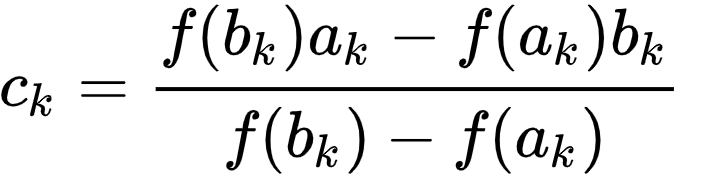

# Aproximación por Bisección o Falsa Posición utilizando Python.

## Introducción

**¿Quién soy?**  
Mi nombre es José Luis Aguilera Luzania y soy un estudiante de la Licenciatura en Ciencias de la Computación en la Universidad de Sonora en México.

**Objetivo**  
El objetivo de este trabajo es demostrar el entendimiento de los métodos de Bisección y Falsa Posición aprendidos en la materia Análisis Numérico. También para prácticar el desarrollo de programas en el lenguaje Python.

**¿Qué es el método de Bisección?**  
El método de Bisección se utiliza para encontrar raíces de funciones, el metodo bisecciona repetidamente un intervalo y escoge el intervalo donde está la raiz, se puede aproximar por número de iteraciones o por error de truncamiento.

  

El método consiste en lo siguiente:
- El intervalo *[a_n, b_n]* debe ser continuo en *f*.
- Se verifica que *f(a_n)\*f(b_n)<0 *
- Se calcula el punto medio *m* del intervalo y se evalúa *f(m)*, si *f(m)=0* entonces *m* es raíz.
- Se define un nuevo intervalo *[a_n, m]* o *[b_n, m]* según el intervalo que tenga cambios de signo.
- Se repite lo anterior hasta llegar a la raíz o a una aproximación.

  

**¿Qué es el método de Falsa Posición?**  
El método de Falsa Posición se utiliza para aproximar raíces de funciones, este método es similar al método anterior pero ahora en lugar de usar el punto medio del intervalo, se usa la intersección con el eje *X* de la recta que une ambos puntos en *a_n* y *b_n*.

  

  

## Algoritmo
El algoritmo se encuentra definido dentro del archivo `algoritmo.py` en la función `aproximar_raiz_por_iteraciones` también existe la función `aproximar_raiz_error_de_truncamiento` que calcula las iteraciones en base al error de truncamiento.

**El algoritmo es el siguiente:**
1. Definir los extremos del intervalo *[a_n, b_n]*
2. Revisar si *a_n* o *b_n* son raices.
	1. Si alguna es raíz, el programa termina.
3. Revisar si existe cambio de signo en el intervalo *[a_n, b_n]*.
	1. Si no hay cambio de signo, el programa termina.
4. Repetir según el número de iteraciones:
	1. Calcular *x_n* con el método seleccionado (Bisección o Falsa Posición).
	2. Calcular el valor de *f(x_n)*.
	3. Revisar si *f(x_n)* es raíz.
		1. Si es raíz, terminar el programa, la raíz se encontro.
	4. Definir el nuevo intervalo *[a_n, b_n]*.
5. Imprimir resultados y terminar el programa.

**Cambiar la función**  
Para cambiar la función a evaluar hay que modificar la función `f` en el archivo `algoritmo.py` (esto cambiará en una versión futura).

## Referencias
1. colaboradores de Wikipedia. (2021, 17 marzo). Método de bisección. Wikipedia, la enciclopedia libre. https://es.wikipedia.org/wiki/M%C3%A9todo_de_bisecci%C3%B3n
2. 03 MÉTODO DE BISECCIÓN - Métodos numéricos ARM. (s. f.). Google Sites - Métodos numéricos ARM. https://sites.google.com/site/metodosnumericosarm/trabajos/03-metodo-de-biseccion
3. colaboradores de Wikipedia. (2020, 28 abril). Método de la regla falsa. Wikipedia, la enciclopedia libre. https://es.wikipedia.org/wiki/M%C3%A9todo_de_la_regla_falsa
4. 4.6 Método de la falsa posición. (s. f.). uv.es. https://www.uv.es/%7Ediaz/mn/node23.html
